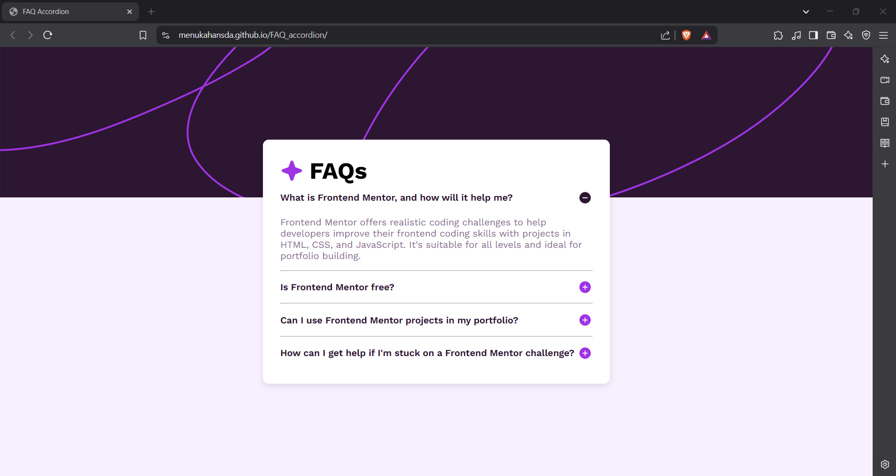
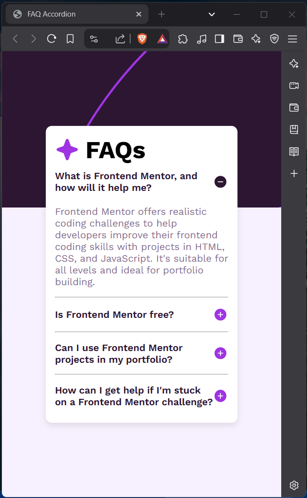

# Frontend Mentor - FAQ accordion solution

This is a solution to the [FAQ accordion challenge on Frontend Mentor](https://www.frontendmentor.io/challenges/faq-accordion-wyfFdeBwBz).  

## Table of contents

- [Overview](#overview)
  - [The challenge](#the-challenge)
  - [Screenshot](#screenshot)
  - [Links](#links)
- [My process](#my-process)
  - [Built with](#built-with)
  - [What I learned](#what-i-learned)
  - [Continued development](#continued-development)
  - [Useful resources](#useful-resources)
- [Author](#author)

## Overview

### The challenge

Users should be able to:

- Hide/Show the answer to a question when the question is clicked
- Navigate the questions and hide/show answers using keyboard navigation alone
- View the optimal layout for the interface depending on their device's screen size
- See hover and focus states for all interactive elements on the page

### Screenshot

This is the screenshot of the web page from a laptop view.

This is the screenshot of the web page from a mobile view.

### Links

- Solution URL: [Github](https://github.com/menukahansda/FAQ_accordion)
- Live Site URL: [Github pages](https://menukahansda.github.io/FAQ_accordion/)

## My process

### Built with

- Semantic HTML5 markup
- CSS custom properties
- Flexbox

### What I learned

I learned how to target elements based on their position as a child within their parent element.

### Continued development

In this challenge, my main difficulty was overlaying the FAQ text on top of the background image. I look forward to working with similar overlay issues and improving my approach to handling them.

### Useful resources

- [Google fonts](https://fonts.google.com) - This helped me find the desired fonts. It offers a wide range of font families that you can incorporate into your project by embedding their links or importing them.

## Author

- Github - [menukahansda](https://github.com/menukahansda)
- Frontend Mentor - [@menukahansda](https://www.frontendmentor.io/profile/menukahansda)

